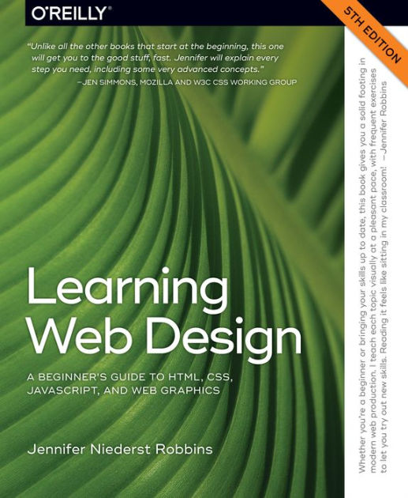

Everyone learns differently but actively working through a good, *modern* book from a reliable author and publisher remains the best way for most to obtain a *comprehensive* understanding of the concepts. In fact, this truth has been codified in tech culture as RTFM, "read the freaking manual" but sometimes there is no manual. When combined with *practical* application of the things learned on projects, challenges, and exercises --- perhaps of your own creation --- and a mentor or community to help you when you get stuck, books provide the *foundation* of everything you need to learn independently.

:::co-warn

## Never Trust Recommendations on the Internet

It might sound obvious, but it's still worth mentioning. Never trust recommendations for books, services, and hardware *unless* you have specific evidence that the recommendations are not motivated by sponsorship or any financial gain. Most "best" lists are straight-up advertisements, nothing more. [RWX]{.spy} contains the biases of its collective authors and their experience but is *never* motivated by sponsorship or other financial gain and never will be. This is why you will never see ads here. 

:::

## Course Book List

These books go with the boost course and provide a solid base tech proficiency. Unfortunately, some of the books are not free but free replacements are constantly under consideration.

* [The Linux Command Line, 2nd Edition (5th Internet Edition)](./tlcl/)
* [Eloquent JavaScript](./eloqjs/)
* [Learning Web Design, 5th Edition](./lwd/)
* [Head First C](./hfc/)
* [Head First Go](./hfgo/)

These books aren't perfect. Sometimes they completely miss an important concept or add something that is outdated or irrelevant. But overall they seem to cover the best basics for beginners. You might find you prefer other, denser books out there as well.

## Other Good Books

* [Learning JavaScript (O'Reilly)](./ljs/)

## Books That are Meh

* [Site Reliability Engineering (Google)](./sregoogle/)

## Books to Actively Avoid

* [Unix and Shell Programming: A Textbook](./unixshprogtb/)
* [You Don't Know Javascript](./ydkjs/)

:::co-faq

## What about *Definitive JavaScript*?

While it was a great book in its time, it is now more than five years old, in web-time that makes is almost entirely irrelevant.

**Aren't tech books bad because they get out of date?**

*Absolutely.* But the advantages of having a common author, with a common writer's voice and exceptional knowledge of that material is worth it over the alternatives.

Of these books Head First Go is the most out of date, but covers the core language concepts enough to become productive with it immediately.

## What about videos on Udemy, YouTube?

Videos are a great way to *supplement* your comprehensive learning from books bolstered with projects and exercises, but videos are rarely anywhere nearly as comprehensive as is required to truly master the topic. Videos are also nearly impossible to search by keyword or index --- especially when digital books are taken into consideration.

:::
