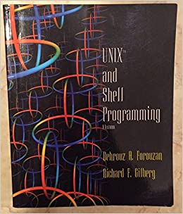

This book is an ancient, overpriced piece of trash that some colleges might make you purchase. All you have to do is read the summary to realize just how old and useless it is. Anyone completing the boost should be able to realize why on their own.

But, to be fair, there are elements of the book that are still relevant --- particularly if you plan on working on UNIX POSIX systems --- but these days that is *very* rare in most occupations. In many ways `grep`, `sed` --- and especially `awk` have been entirely superseded by modern Bash syntax. This book even covers C shell. 

:::co-tip
If you every see a job posting asking for C shell skills delete it and move on. 
:::

> Designed as one of the first true textbooks on how to use the UNIX operating system and suitable for a wide variety of UNIX-based courses, UNIX and Shell Programming goes beyond providing a reference of commands to offer a guide to basic commands and shell programming. Forouzan/Gilberg begin by introducing students to basic commands and tools of the powerful UNIX operating system. The authors then present simple scriptwriting concepts, and cover all material required for understanding shells (e.g., Regular Expressions, grep, sed, and awk) before introducing material on the Korn, C, and Bourne shells. Throughout, in-text learning aids encourage active learning and rich visuals support concept presentation. For example, sessions use color so students can easily distinguish user input from computer output. In addition, illustrative figures help student visualize what the command is doing. Each chapter concludes with problems, including lab sessions where students work on the computer and complete sessions step-by-step. This approach has proven to be successful when teaching this material in the classroom.

Ok boomer.

