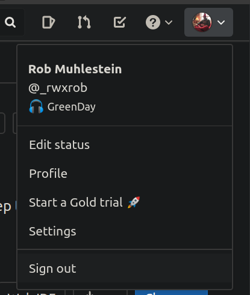
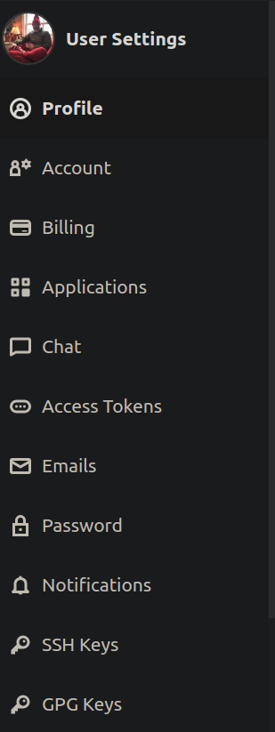
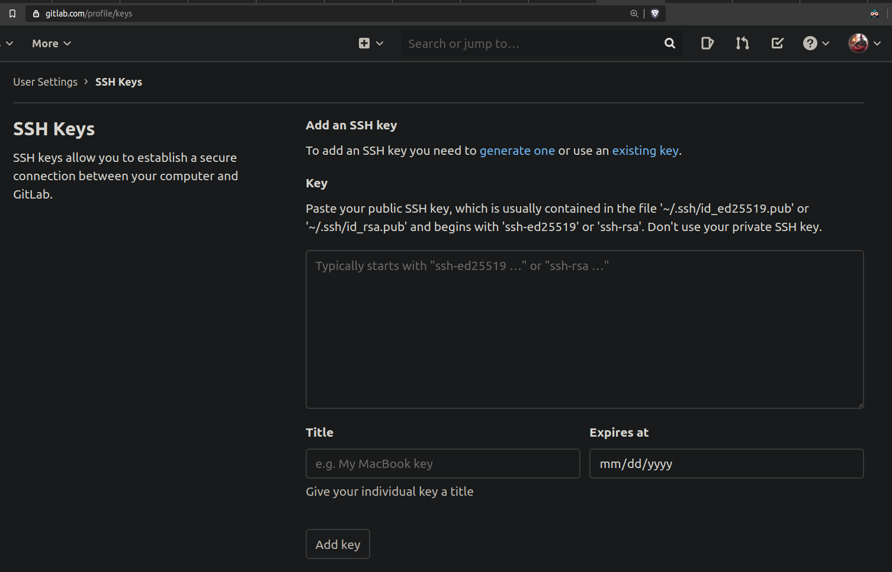

Here's how to add a [public key](/tools/ssh/tasks/keygen/) to your GitLab account.

Find the user drop-down menu and click it.

Then find your user settings pane ***to the left*** and click `SSH Keys`.

You'll see the following page open up. Cut *all* of your [public key](/tools/ssh/tasks/catpub/) (yes including the stuff at the end) and paste into the box and click `Add`.

You know have a new public key available. Might want to check that it works with a [Git Ping](/tools/git/ping/).
