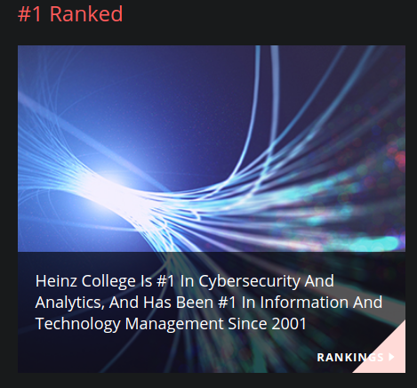
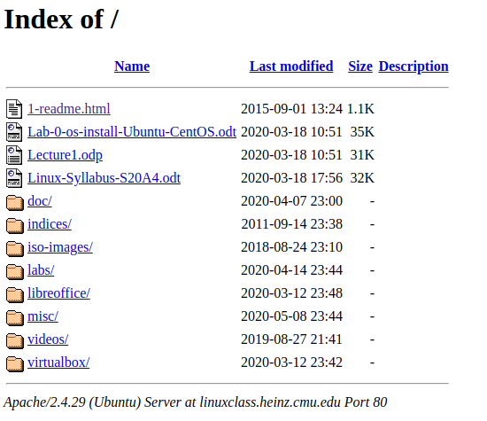

The following are first-hand accounts and evidence of substantial failures of educational organizations and institutions to stay relevant.

## College Teaching Java Applets in 2020

A community member reported directly in live stream that he is  currently learning "Java applets" in his college Computer Science course.

## Carnegie Mellon University, Heinz College  
*95-799 Linux & Open Source Mini --- Spring 2020*

* Claims "#1 in Cybersecurity Higher Education"

* <https://api.heinz.cmu.edu/courses_api/course_detail/95-799>  
* <http://linuxclass.heinz.cmu.edu/>  

* Still thinks SourceForge is relevant and GitHub is "new"

* Seemingly unaware that Microsoft now ships with Linux built in and has several core kernel contributors working in their Linux division.

* Serving directory listings as main web page.

* Insanely overpriced forcing massive student debt.
* Cost: 6 units, ~$2000
* Average first-year cost: $51,000 
* Four year degree cost: \$204,000

## [Creationism Mandated in Public Schools](https://www.natlawreview.com/article/alternative-facts-classroom-creationist-educational-policy-and-trump-administration)

Creationism is not science.

## Flat Earth Debated in High School CS Class

First hand accounts of students at Hough High School in Cornelius, North Carolina have been reported of a CS High School instructor dividing her class in two to "debate" the position of the [Flat Earth Society](https://duck.com/lite?kae=t&q=Flat Earth Society) rather than study computer science at all as an "activity." The "teacher" openly acknowledges her position that the Earth is, in fact, flat.
